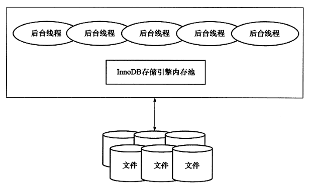

# 第一章 MySQL体系结构和存储引擎

## 1.1 数据库和实例

> 从概念上来说，数据库是文件的集合，是依照某种数据模型组织起来并存放于二级存储器中的数据集合；数据库实例是程序，是位于用户与操作系统之间的一层数据管理软件，用户对数据库数据的任何操作，包括数据库定义、数据查询、数据维护、数据库运行控制等都是在数据库实例下进行的，应用程序只有通过数据库实例才能和数据库打交道。

**数据库**：物理操作系统文件或其他形式文件类型的集合。在MySQL数据库中，数据库文件可以是frm、MYD、MYI、ibd结尾的文件。当使用NDB引擎时，数据库的文件可能不是操作系统上的文件，而是存放于内存之中的文件，但是定义仍然不变。

**实例**：MySQL数据库由后台线程以及一个共享内存区组成。共享内存可以被运行的后台线程所共享。需要牢记的是，数据库实例才是真正用于操作数据库文件的。

MySQL数据库实例在系统上的表现就是一个进程。配置文件my.ini/my.cnf  中有一个参数datadir，指定了数据库所在的路径


## 1.5 连接MySQL

### 1.5.1 TCP/IP

TCP/IP套接字是MySQL数据库在任何平台下都提供的连接方式，这种方式在TCP/IP连接上建立一个基于网络的连接请求。

```mysql -hxxx.xxx.xxx.xxx -u xxxx -p```

### 1.5.2 命名管道和共享内存


### 1.5.3 UNIX域套接字


# 第二章 InnoDB存储引擎

## 2.3 InooDB系统架构

InnoDB存储引擎有多个内存块，组成内存池，负责以下工作：

- 维护所有进程/线程需要访问的多个内部数据结构
- 缓存磁盘上的数据，方便快速地读取，同时在对磁盘文件的数据修改之前在这里缓存
- 重做日志（redo log）缓存

.......



后台线程的主要作用是负责刷新内存池中的数据，保证缓冲池中的内存缓存的是最近的数据。此外将已修改的数据文件刷新到磁盘文件，同时保证数据库发生异常时InnoDB能够恢复到正常运行状态

### 2.3.1 后台线程

1. **Master Thread**

​	Master Thread 是一个非常核心的后台线程，主要负责将缓冲池中的数据异步刷新到磁盘，保证数据的一致性。包括脏页的刷新、合并插入缓存（INSERT BUFFER）、UNDO页的回收等。

2. **IO Thread**

​	在InnoDB存储引擎中大量使用了AIO（Async IO）来处理写IO请求，可以极大提高数据库的性能。IO Thread的工作主要是负责这些IO请求的回调处理。

3. **Purge Thread**

​	事务被提交后，其所使用的undolog可能不再需要，因此需要该线程来收回已经使用并分配的undo页。

4. **Page Cleaner Thread**

​	负责之前版本中脏页的刷新操作，减轻Master Thread的工作以及对于用户查询线程的阻塞


### 2.3.2 内存

1. **缓冲池**

​	在数据库中进行读取页的操作，首先将从磁盘读取到的页放在缓冲池中

2. **LRU List、Free List和Flush List**

​	数据库中的缓冲池是通过LRU算法来进行管理的。在InnoDB的存储引擎中，LRU列表还加入了midpoint位置。新读到的页会放入LRU列表的midpoint位置，由参数innodb_old_blocks_pct控制。 使用midpoint的原因是某些SQL操作可能会使得缓冲池中的页被刷新出，比如索引或数据的扫描操作，这类操作需要访问表中的许多页，甚至是全部的页，而这些页通常来说又仅在这次查询操作中需要，并不是活跃的热点数据。

​	innodb_old_blocks_time用以表示页读取到mid位置后需要等待多久才会被加入到LRU列表的热端。

3. **重做日志缓冲**

​	InnoDB存储引擎首先将重做日志信息先放入到缓冲区，然后再按照一定频率将其刷新到重做日志文件。

4. **额外的内存池**


## 2.4 Checkpoint技术

缓冲池的设计目的是为了协调CPU速度与磁盘速度的差异

页的操作首先在缓冲池中完成，更新和删除操作改变了页的记录，使其变成脏页

为了避免数据丢失的问题，当前事务数据库系统普遍都采用了Write Ahead Log 策略，即当事务提交时，先写重做日志，再修改页。当由于发生宕机而导致数据丢失时，通过重做日志来完成数据的恢复，这是事务ACID中D（Durability持久性）的需求

Checkpoint技术的目的：

- 缩短数据库的恢复时间
- 缓冲池不够用时，将脏页刷新到磁盘
- 重做日志不可用时，刷新脏页

当数据库发生宕机时，数据库不需要重做所有日志，因为Checkpoint之前的页都以及刷新回磁盘。数据库只需要对Checkpoint后的重做日志进行恢复。


Sharp Checkpoint：发生在数据库关闭时将所有的脏页都刷新回磁盘，是默认的工作方式。如果数据库在运行时使用Sharp Checkpoint，可用性大受影响。

Fuzzy Checkout：只刷新一部分脏页


## 2.5 Master Thread工作方式

### 2.5.1 InnoDB 1.0.x版本之前的Master Thread

Master Thread具有最高的线程优先级别，内部由多个循环（loop）组成：主循环、后台循环、刷新循环、暂停循环。

Loop为主循环，其中有两大部分的操作——每秒的操作和每10秒的操作，loop循环通过thread sleep来实现

每秒一次的操作包括：

- 日志缓冲刷新到磁盘，即使事务还没有提交（总是）；
- 合并插入缓存（可能）
- 至多刷新100个InnoDB的缓冲池的脏页到磁盘（可能）
- 如果当前没有用户活动，则切换到background loop（可能）


background loop，如果当前没有用户活动（数据库空闲时）或者数据库关闭（shutdown），就会切换到这个循环，执行以下操作：

- 删除无用的undo页（总是）
- 合并20个插入缓存（总是）
- 跳回到主循环（总是）
- 不断刷新100个页直到符合条件（可能，转跳到flush loop中完成）

### 2.5.2 InnoDB 1.2.x版本之前的Master Thread


## 2.6 InnoDB关键特性

### 2.6.1 插入缓冲

**Insert Buffer**

InnoDB存储引擎开创性地设计了Insert Buffer，对于非聚集索引的插入或更新操作（相比于主键索引是离散访问），不是每一次直接插入到索引页中，而是先判断插入的非聚集索引页是否在缓冲池中，若在，则直接插入；若不在，则先放入到一个Insert Buffer对象中。

Insert Buffer的使用需要满足：

- 索引是辅助索引
- 索引不是唯一的

**Change Buffer**

### 2.6.2 两次写


### 
