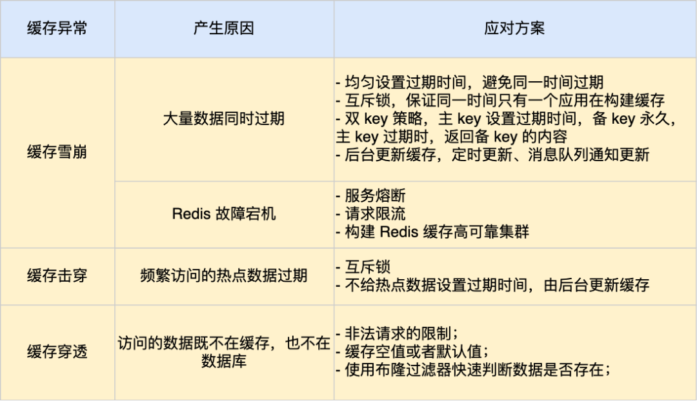
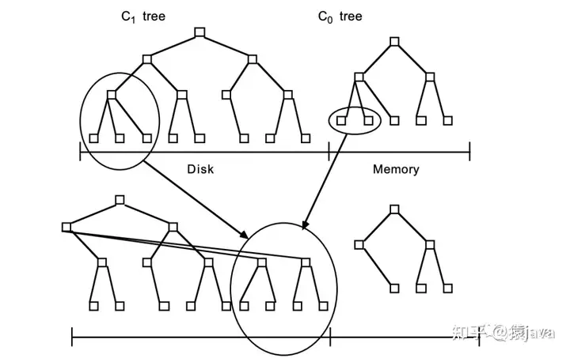

# Kafka

## 1. 消息挤压怎么办

​		**1. 增加消费者数量：**增加消费者数量可以提高消息的消费速度，减少积压。可以通过增加消费者组中的消费者数量或者增加消费者实例来实现。这样每个消费者可以并行处理消息，提高整体消费能力。

　　**2. 增加分区数量：**在 Kafka 主题中增加分区数量可以将负载分散到更多的分区中，增加消费能力。通过增加分区数量，可以使多个消费者并行处理消息，从而减少积压。

　　**3. 提高消费者的处理能力：**优化消费者的处理逻辑，确保消费者能够快速处理每条消息。消费者处理消息的速度要高于消息的生产速度，以避免消息积压。

　　**4. 调整 Kafka 的配置参数：**根据实际情况，可以调整 Kafka 的配置参数来优化性能。例如，可以调整消息的压缩方式、调整批量处理的大小、调整网络相关的参数等，以提高整体性能和吞吐量。

​		**5. 增加 Kafka 集群的资源：**如果 Kafka 集群的资源(例如磁盘、内存、网络带宽等)有限，可以考虑增加资源来提高整体性能。增加磁盘空间可以避免由于磁盘满导致的消息无法写入的情况，增加内存可以提高 Kafka 的缓存能力，增加网络带宽可以加快消息的传输速度等。

　　**6. 监控和调优：**定期监控 Kafka 集群的性能指标，例如消息的生产和消费速度、积压数量等。根据监控结果，进行调优和优化，以提高整体的性能和稳定性。


## 2. 如何保证消息有序

- 消息分区

​		kafka将数据分散存储到多个broke节点上。每个topic可以被划分成多个不同的分区。每个分区内的消息都是有自己的offset偏移量。这个offset可以看作是一条消息在分区中的唯一标识符，kafka会确保每个分区内部的消息存储顺序是有序的。

- 生产者端有序性

​		在kafka中，生产者(producer)可以选择将消息发送到指定的分区，也可以让kafka自动为消息选择一个合适的目标分区。当生产者使用同步发送(sync)方式将消息发送到指定的分区时，kafka会按照消息发送的顺序依次将它们写入到目标分区中。

- 消费者端有序性

​		消费者(consumer)从kafka中读取消息时，可以指定读取的起始位置(offset)，kafka会按照offset顺序返回消息给客户端。在消费者组消费场景下，kafka还会对多个消费者之间的消息进行协调，确保每条消息只能被其中一个消费者处理，并且每个消费者只能读取到特定分区内的消息，这样就保证了消费者端的有序性

## 3. group

在Kafka中，group的概念存在保证了消息分发的机制灵活性和消费者规模的伸缩性

**1、保证分布式消费、2、消息广播、3、容错性强化、4、负载均衡、5、消费者状态管理**

在一个group中，每个消费者负责订阅主题中的一个或多个分区，保障每个消息只被group中的一个消费者处理，实现负载均衡和分布式数据处理。负载均衡机制通过消费者与分区之间的动态分配实现，当新的消费者加入或现有消费者离开group时，分区会重新分配，确保处理能力与消费者数量相适应。

- Group的消息分发策略

负载均衡：组内的每个消费者都会被分配到独立的分区上以均衡工作负载

消息广播：可以设置多个消费者组订阅同一个主题，实现消息的多播

- 容错机制

当某个消费者实例失效时，Kafka消费者组能够重新分配该实例所处理的分区给组内的其他消费者，从而维持服务的持续可用和数据流的处理不间断。这种机制提供了对故障的快速恢复能力。

- 负载均衡特性

新增/减少消费者实例，Kafka会自动触发重新平衡操作，动态调整每个消费者实例所处理的分区数量和位置

- consumer group 的状态维护

Kafka消费者组内的每个消费者都会定期向协调者（Coordinator）发送心跳（heartbeats），以保持其在组内的活跃状态。同时，消费者的偏移量（offset）也会持久化保存，一旦消费者实例发生更替，新的消费者可以接着前者的位置继续消费，保证了数据的一致性和完整性。


## 4. 消息队列重复消费

生产者产生原因：

- **网络延迟**，导致消息发送后，生产者收不到 ack 确认，认为消息丢失，重新发送，导致同一个请求的消息发送了两份。

- **服务故障**，导致消息队列发送接收确认 ack 的时候，系统宕机，导致消息重新发送。

- 生产者端，没有对用户操作的不当行为，比如多次点击，发送多次请求进行处理。导致消息重复发送，还可能会造成 MQ 宕机（恶意请求）。

消费端产生原因 ：

- 网络问题

- 消息队列一般对消息消费失败都有重试机制（RocketMQ 有，kafka 没有），假如有一个消息消费执行了某些逻辑后在删除标识时（在实现了幂等消费的情况下）失败了 (服务宕机，断电等问题导致中断)，那消息队列就会进行重试，而造成重复消费。

解决办法：

- 唯一消息标识

为了避免重复消费，每条消息应该有一个唯一的标识符，通常是消息ID。消费者在处理消息时，可以将消息ID存储在本地，以便后续检查是否已经处理过相同ID的消息。如果已经处理过，就可以跳过该消息。

- 幂等性处理

幂等性是指无论操作执行多少次，最终的结果都是一致的。在MQ消费中，实现幂等性是避免重复消费的关键。

为了实现幂等性，你需要确保消息处理操作是幂等的。这通常涉及到对相同消息的多次处理不会产生不同的效果。例如，如果你的消息是用来更新数据库记录的，你可以使用唯一标识符来检查是否已经存在相同的记录，如果存在就不执行更新操作。


kafka重复消费出现的场景：

1. Consumer消费过程中，进程挂掉/异常退出。kafka消费端的使用中，位移(offset)的提交有两种方式，自动提交和手动提交。在提交offset前消费者挂了，当消费者重启后再次拉取offset时会依然拉取之前消费掉的offset，因此造成重复消费的问题。
2. 消费者消费时间过长，kafka消费端的参数max.poll.interval.ms定义了两次poll的最大间隔，默认5min，消费者在者5分钟内无法消费完poll方法返回的消息，那么consumer就会主动发起“离开组”的请求，离开后开始rebalance，因此提交offset失败。

kafka重复消费解决方案：

1. 针对消费者挂掉等原因：设计代码时以幂等性的角度进行开发设计，保证同一数据无论进行多少次消费，所造成的结果都是一样的。处理方式可以在消息体中添加唯一标识（保存到mysql或redis中，处理消息前检查一下是否以及处理过了）。或者将版本号(offset)存入数据里面，然后要操作数据的时候用这个版本号作为乐观锁，当版本号大于原先的才能操作。
2. 针对消费者消费时间过长的原因：提高单条消息的处理速度，对消息处理中耗时的操作可以异步处理；将参数调大。


# Redis

## 1. 跳表

对链表进行改造，在链表上建索引，即每两个结点提取一个结点到上一级，我们把抽出来的那一级叫作索引。这种链表加多级索引的结构，就是跳表。


## 2. 双写一致性

**先更新数据库，再删除缓存**虽然保证了数据库与缓存的数据一致性，但是每次更新数据的时候，缓存的数据都会被删除，这样会对缓存的命中率带来影响。

删除缓存操作失败的处理办法：1. 将删除操作加入消息队列，由消费者来操作数据，利用消息队列的重试机制  2. 订阅MySql binlog，再更新缓存


如果业务对缓存的命中率有很高的要求，可以采用**更新数据库+更新缓存**的方案，因为更新缓存不会出现缓存未命中，但是会有并发问题，出现数据不一致，因为更新数据库和更新缓存操作独立，两个线程并发更新它们会因为写入顺序的不同造成数据的不一致。

解决办法： 1. 在更新缓存前加一个分布式锁，保证同一时间只运行一个请求更新缓存 2. 在更新完缓存时，给缓存加上较短的过期时间


**延迟双删**

对了，针对「先删除缓存，再更新数据库」方案在「读 + 写」并发请求而造成缓存不一致的解决办法是

先删除缓存 然后更新数据库 然后睡眠一段时间再删除缓存

```
def update_data(key, obj):
    del_cache(key)     # 删除 redis 缓存数据。
    update_db(obj)     # 更新数据库数据。
    logic_sleep(_time) # 当前逻辑延时执行。
    del_cache(key)     # 删除 redis 缓存数据。
```


- 延时双删有啥作用？

- - 为了尽可能的保证缓存和数据库数据最终一致。

- 为什么要删除缓存数据，而不是修改？

- - 如果是修改，并发修改数据场景，先改缓存的有可能后改库，先改库的也可能后改缓存。

- 为什么要睡眠延时一段时间？

- - 读写分离是解决高并发比较有效的方案，但是缓存/库的主从是异步更新数据的。
  - 睡眠一段时间，就是为了库和缓存能实现数据主从同步。

- 延时双删能确保缓存和数据库最终一致吗？

- - 不能确保。
  - 只能通过延时最大程度上提高数据的最终一致的概率。
  - 如果缓存和数据库负载很高，主从同步很慢，很有可能不能在延时的时间内实现同步。

- 脏读怎么办？

- - 确实有这问题，要知道这是最终一致，并不是强一致，最后一次删除就是为了最终一致^_^！
  - 所以要确保你的业务场景能忍受数据最终一致的缺陷，实在不行你读主库呗。

- 为什么要有第一次删除缓存？
  1> 删除脏读。
  2> 提前实现其它操作的数据最终一致。

- - 延时双删有 4 个步骤，全部执行完才能实现数据最终一致，可能会比较慢！
  - 延时双删第三个步骤延时等待是比较漫长的，有可能在等待时间超时前，数据就已经完成同步了。在并发环境中，如果其它并发环节增加第一次删除，可能会提前实现前面操作的数据最终一致，不用等延时双删四个步骤都完成。
  - 首先延时双删不是强一致，只能是一段时间内保证数据库和缓存最终一致，当然这个时间是越快越好，所以第一次删除的意义在于可以加快这个速度

- 两次删除如果都失败怎么办？
  - 小系统随便搞个短一点的过期时间 + 修改一下过期时间就行   高级一点的系统就用Canal（binlog日志订阅）最简单的

## 3. 大key

Redis 的大Key问题是指Redis中的某个key对应的数据结构过大，导致Redis运行缓慢、CPU占用率过高、网络负载增加等情况。

- 单线程：redis是单线程的，处理某个数据结构时会占用整个CPU进行计算，因此大Key的处理会使得Redis无法处理其他请求
- 内存分配：内存压力，导致内存不足，被迫使用swap影响性能。Redis内存分配是按照内存块进行分配，key对应的数据过大可能无法找到足够的连续内存空间分配内存
- 持久性问题：备份慢

解决方案：

- 拆分：优化redis数据结构，将大key拆分成多个小key存储
- 清理：增量式删除数据，删除大key的时候，将数据分批次删除

- 使用更大的内存来容纳

- 分布式，使用集群来实现数据的分布式存储和读写操作的负载均衡

  

## 4. 热key

Redis 中访问频率高的Key称为热key

原因：

- 用户消费数据远大于生成的数据，如商品秒杀、热点行文、热点评论等读多写少的场景
- 请求分片集中，超过单台redis服务器的性能

问题：

- 缓存击穿：热点数据过期，数据库扛不住。

解决方案：

- redis集群扩容：增加分片副本，分担读请求
- 使用二级缓存，即（JVM）本地缓存。例如使用Caffeine+redis 实现二级缓存，先从本地缓存中取，取不到再去redis中去取。

## 5. 缓存穿透 缓存雪崩 缓存击穿




## 6. zset

Zset对象要同时保持元素和元素的权重

跳表是在链表的基础上改进过来的，实现了一种多层的有序链表

怎样维持相邻两层节点的数量比例为2：1呢？

redis采用一种巧妙的方法：跳表在创建节点的时候，随机生成每个节点的层数。跳表在创建节点的时候，会生成范围为【0-1】的一个随机数，如果随机数小于0.25，那么层数就增加一层，然后继续生成下一个随机数，直到随机数的结果大于0.25结束

为什么用跳表而不用平衡树？

- 在做范围查找的时候，跳表比平衡树操作更加简单。平衡树要做中序遍历，而跳表只需要对第一层链表进行遍历就行。
- 算法实现难度上来比较，跳表比平衡树简单得多。平衡树得插入和删除操作可能引发子树得调整，逻辑复杂。

- 内存占用上来比较，跳表比平衡树更加灵活。


# ElasticSearch

ES是一个基 Lucene的Java开发的搜索引擎，是一个分布式、可扩展、实时的搜索与数据分析引擎，可以解决项目中的多维搜索问题

## 1. 基本概念

es本质上是一个分布式数据库，运行多台服务

器协同工作，每台服务器可以运行多个es实例。单个es实例为一个节点（Node），一组节点构成一个集群（Cluster).


- 一个**索引**就是一个拥有几分相似特征的文档的集合。ES将数据存储于一个或多个索引之中，索引就相当于SQL中的一个数据库
- **类型**就是索引内部的逻辑分区(category/partition)，然而其意义完全取决于用户需求。因此，一个索引内部可以定义一个或多个类型(type)。一般来说，类型就是为拥有相同域的文档做的预定义。Elasticsearch中的类型（‌type）‌在7.x版本后被逐步淘汰，‌并在未来的版本中计划完全移除。‌假设在一个index中建立很多type，并且这些type下的document都没有相同的字段，那么会导致数据极其稀疏（因为会合并，没有的字段是空字符串），影响ES的存储、检索效率。
- 文档（Document)是Lucene索引和搜索的原子单位，它是包含了一个或多个域的容器，基于Json格式进行表示。文档有一个或多个域组成，每一个域拥有一个名字以及一个或多个值，有多个值的域通常被称为 多值域，每个文档可以存储不同的域集，但同一类型下的文档至应该有某种程度上的相似之处。相当于 mysql 表中的 row 。
- Field（字段） 相当于数据库中的Column

### 1.1 分片&副本

一个 **索引** 可以存储超出单个结点硬件限制的大量数据。比如，一个具有 10亿文档的索引占据 1TB 的磁盘空间，而任一节点都没有这样大的磁盘空间；或者单个节点处理搜索请求，响应太慢。

为了解决这个问题，`Elasticsearch 提供了将索引划分成多份的能力`，这些份就叫做 **分片**。当你创建一个索引的时候，你可以指定你想要的 **分片的数量**。每个分片本身也是一个功能完善并且独立的 **索引**，这个 **索引** 可以被放置到集群中的任何节点上

副本是一个分片的精确复制，每个分片可以有零个或多个副本。副本的作用：

1. 提高系统的容错性，当某个节点某个分片损坏或丢失时，可以从副本中恢复。
2. 提高 ES 查询效率，ES 会自动对搜索请求进行负载均衡。

## 2. 倒排索引

倒排索引作为一种数据结构，用于存储一种映射关系，即从词项到出现该词项的文档的映射

Per-segment search，也即**按段搜索**，是Lucene中的概念。每个段本身就是一个倒排索引，Lucene中的索引除了表示段的集合外，还增加了提交点的概念，一个提交点就是一个列出了所有已知段的文件。

## 3. 写操作


当我们发送索引一个新文档的请求到协调节点后，将发生如下一组操作：

- Elasticsearch集群中的每个节点都包含了改节点上分片的元数据信息。协调节点(默认)使用文档ID参与计算，以便为路由提供合适的分片。Elasticsearch使用[MurMurHash3](https://en.wikipedia.org/wiki/MurmurHash)函数对文档ID进行哈希，其结果再对分片数量取模，得到的结果即是索引文档的分片。

  ```
  shard = hash(document_id) % (num_of_primary_shards)
  ```

- 当分片所在的节点接收到来自协调节点的请求后，会将该请求写入translog(我们将在本系列接下来的文章中讲到)，并将文档加入[内存缓冲](http://www.linfo.org/buffer.html)。如果请求在主分片上成功处理，该请求会并行发送到该分片的副本上。当translog被同步([fsync](http://linux.die.net/man/2/fsync))到全部的主分片及其副本上后，客户端才会收到确认通知。

- 内存缓冲会被周期性刷新(默认是1秒)，内容将被写到文件系统缓存的一个新段上。虽然这个段并没有被同步(fsync)，但它是开放的，内容可以被搜索到。

- 每30分钟，或者当translog很大的时候，translog会被清空，文件系统缓存会被同步。这个过程在Elasticsearch中称为冲洗(flush)。在冲洗过程中，内存中的缓冲将被清除，内容被写入一个新段。段的fsync将创建一个新的提交点，并将内容刷新到磁盘。旧的translog将被删除并开始一个新的translog。

  

- **更新((U)pdate)和删除((D)elete)**

  删除和更新也都是写操作。但是Elasticsearch中的文档是不可变的，因此不能被删除或者改动以展示其变更。那么，该如何删除和更新文档呢？

  磁盘上的每个段(segment)都有一个相应的.del文件。当删除请求发送后，文档并没有真的被删除，而是在.del文件中被标记为删除。该文档依然能匹配查询，但是会在结果中被过滤掉。当段合并(我们将在本系列接下来的文章中讲到)时，在.del文件中被标记为删除的文档将不会被写入新段。

  接下来我们看更新是如何工作的。在新的文档被创建时，Elasticsearch会为该文档指定一个版本号。当执行更新时，旧版本的文档在.del文件中被标记为删除，新版本的文档被索引到一个新段。旧版本的文档依然能匹配查询，但是会在结果中被过滤掉。

  文档被索引或者更新后，我们就可以执行查询操作了。让我们看看在Elasticsearch中是如何处理查询请求的。

**剖析读操作((R)ead)**

读操作包含2部分内容：

- 查询阶段
- 提取阶段

我们来看下每个阶段是如何工作的。

**查询阶段**

在这个阶段，协调节点会将查询请求路由到索引的全部分片(主分片或者其副本)上。每个分片独立执行查询，并为查询结果创建一个优先队列，以相关性得分排序(我们将在本系列的后续文章中讲到)。全部分片都将匹配文档的ID及其相关性得分返回给协调节点。协调节点创建一个优先队列并对结果进行全局排序。会有很多文档匹配结果，但是，默认情况下，每个分片只发送前10个结果给协调节点，协调节点为全部分片上的这些结果创建优先队列并返回前10个作为hit。

**提取阶段**

当协调节点在生成的全局有序的文档列表中，为全部结果排好序后，它将向包含原始文档的分片发起请求。全部分片填充文档信息并将其返回给协调节点。

下图展示了读请求及其数据流


## 4. FST：（Finite-State Transducer）有限状态转化机

### 4.1 简介

FST最重要的功能是可以实现key到value的映射，相当于HashMap<K,V>。FST的查询速度比hashMap慢一点，但是内存消耗比hashMap小很多。FST在lucene大量使用:倒排索引的存储，同义词词典的存储，搜索关键字建议等等。
对于es来说，它是基于lucence开发，底层的数据结构使用的就是FST

优点: 查询快、极致压缩空间占用
特性:
    确定性:在任何给定状态下，对于任何输入，最多只能遍历一个transtion
    非循环:不可能重复遍历同一个状态
    transducer: 转化器有相关的值(payload),final节点会输出一个值
    比起前面的前缀树以及FSA，在存储的时候多了一个value值。


## 5. 刷盘机制和刷新机制

刷盘机制‌主要涉及到将数据从内存写入磁盘的过程。在ES中，刷盘机制包括同步刷盘和异步刷盘两种方式。同步刷盘是指每次修改操作完成后立即执行fsync命令将数据刷到磁盘，确保数据的持久性。异步刷盘则是默认每5秒执行一次fsync命令刷盘，这种方式可以提高写入性能，但可能会在服务器宕机时导致数据丢失。刷盘的过程还包括将translog日志文件持久化到磁盘，这是一个顺序写入的过程，开销不大，用于保证在服务器宕机时数据的恢复能力‌

‌刷新机制‌则是指将数据从ES缓冲区转换成新的segment并写入系统文件缓存的过程。这个过程默认每1秒进行一次，使得数据能够被搜索到。由于数据只有到了系统文件缓存才能被搜索到，这个过程也解释了ES被称为近实时搜索的原因。刷新机制还包括后台自动合并小的segment成大的segment的过程，以提高存储效率和查询性能‌


## 6. 准实时搜索

在内存索引缓冲区中的文档会被写入到一个新的段中，这里新段会被先写入到文件系统缓存（这一步代价会比较低），稍后再被刷新到磁盘（这一步代价比较高）。不过只要文件已经在缓存中， 就可以像其它文件一样被打开和读取了。

默认情况下，每个分片会每秒自动刷新（refresh）一次。这就是为什么我们说ES是近实时搜索。文档的变化并不是立即对搜索可见，但会在一秒之内变为可见。


# Hbase

## 1. 基本概念

**优点**：**HBase** 底层基于HDFS存储，高可用、高扩展、强一致性，支持上亿级别数据

特点：

- 海量存储：适合存储PB级别的海量数据，能在几十到几百毫秒内返回数据
- 列式存储：根据列族再存储数据。列族下面可以有非常多的列
- 高并发
- 稀疏性：HBase的列具有灵活性，在列族中，你可以指定任意多的列，在列数据为空的情况下，是不会占用存储空间的。

## 2. 逻辑结构

1. Table(表)：

> 表由一个或者多个`列族`构成。数据的属性如name、age、TTL(超时时间)等都在列族里边定义。定义完列族的表是个空表，只有添加了数据行以后，表才有数据。

1. Column (列)：

> HBase 中的每个列都由 Column Family(列族) 和 Column Qualifier(列限定符)进行限定，例如 info：name、info：age。建表时只需指明列族，而列限定符无需预先定义。

1. Column Family(列族)：
2. 多个列`组合`成一个列族。建表时不用创建列，在 HBase 中列是`可增减变化`的！唯一要确定的是`列族`，表有几个列族在开始创建时就定好的。表的很多属性，比如数据过期时间、数据块缓存以及是否使用压缩等都是定义在列族上的。
3. HBase 会把相同列族的几个列数据尽量放在同一台机器上。
4. Row(行)：

> 一行包含多个列，这些列通过列族来分类。行中的数据所属的列族从该表所定义的列族中选取。由于HBase是一个面向列存储的数据库，所以一个`行中的数据可以分布在不同的服务器上`。

1. RowKey(行键)：

> RowKey 类似 **MySQL** 中的主键，在 HBase 中 RowKey 必须有且 RowKey 是按照字典排序的，如果用户不指定 RowKey 系统会自动生成不重复字符串。查询数据时**只能根据 RowKey 进行检索**，所以 Table 的 RowKey 设计十分重要。

1. Region(区域)：
2. Region 就是若干行数据的集合。HBase 中的 Region 会根据数据量的大小动态分裂，Region是基于HDFS实现的，关于Region的存取操作都是调用HDFS客户端完成的。同一个行键的 Region 不会被拆分到多个 Region 服务器上。
3. Region 有一点像关系型数据的分区，数据存放在Region中，当然Region下面还有很多结构，确切来说数据存放在MemStore和HFile中。访问HBase 时先去HBase 系统表查找定位这条记录属于哪个Region ，然后定位到这个Region 属于哪个服务器，然后就到哪个服务器里面查找对应Region 中的数据。


1. RegionServer：

> RegionServer 就是存放Region的容器，直观上说就是服务器上的一个服务。负责管理维护 Region。


## 3. 物理存储

**Region**

每一个 Region 都有起始 RowKey 和结束 RowKey，代表了存储的Row的范围一个Region有多个Store，一个Store就是对应一个列族的数据，Store 由 MemStore 和 HFile 组成的。

**Store**

Store 由 MemStore 跟 HFile 两个重要的部分。

**MemStore**

每个 Store 都有一个 MemStore 实例，数据写入到 WAL 之后就会被放入 MemStore 中。MemStore是内存的存储对象，当 MemStore 的大小达到一个阀值（默认64MB）时，MemStore 会被 flush到文件，即生成一个快照。目前HBase 会有一个线程来负责MemStore 的flush操作。

**StoreFile**

MemStore 内存中的数据写到文件后就是StoreFile，StoreFile底层是以 HFile 的格式保存。HBase以Store的大小来判断是否需要切分Region。

**HFile**

在Store中有多个HFile，每次刷写都会形成一个HFile文件落盘在HDFS上。HFile文件也会动态合并，它是数据存储的实体。

这里提出一点疑问：操作到达Region时，数据进入HFile之前就已经被持久化到WAL了，而WAL就是在HDFS上的，为什么还要从WAL加载到MemStore中，再刷写成HFile呢？

1. 由于HDFS支持文件创建、追加、删除，但不能修改！但对数据库来说，数据的顺序非常重要！
2. 第一次WAL的持久化是为了保证数据的安全性，无序的。
3. 再读取到MemStore中，是为了排序后存储。
4. 所以MemStore的意义在于维持数据按照RowKey的字典序排列，而不是做一个缓存提高写入效率。

## 4. LSM-Tree原理

LSM-Tree：Log-Structured Merge Tree，翻译成中文是：日志结构合并树。其思想源于论文《The Log-Structured Merge Tree》，论文链接：[https://www.cs.umb.edu/~poneil/lsmtree.pdf](https://link.zhihu.com/?target=https%3A//www.cs.umb.edu/~poneil/lsmtree.pdf)，从论文可以总结出，早期 LSM-Tree 的思路是将索引树结构拆成一大一小两棵树，小的索引树 C0 tree 存储在内存， 大的索引树 C1 tree 存储在磁盘，它们共同维护一个有序的 key空间。如下图：



但是，随着业务的快速发展，LSM-Tree 也在发生着变化，现代 LSM-tree 包含了三个部分：memtable、immutable memtable、SSTable，前两个位于内存，最后一个位于磁盘中。如图下：


不过，早期的 LSM-Tree 和现代的 LSM-Tree 的核心思想是一样：**充分利用了磁盘批量顺序写的速度要远比随机写性能高出很多，再加上内存 + 磁盘多层合并，大大提升了读写性能。**

从 LSM-Tree 的发展，我们可以看出，LSM-Tree 俨然已经从最开始的搜索树发展成了一种多层级的读写流程，不再是一棵树了。

LSM-tree 核心是将写入操作与合并操作分离，通过将数据写入日志文件和内存缓存，然后定期进行合并操作来提高写入和查询的性能。

# 数据库

## 1. undolog redolog binlog

undo log 是一种用于撤销回退的日志。在事务没提交之前，MySQL 会先记录更新前的数据到 undo log 日志文件里面，当事务回滚时，可以利用 undo log 来进行回滚。如下图：

undo log 还有一个作用，通过 ReadView + undo log 实现 MVCC（多版本并发控制）。


- 「读提交」隔离级别是在每个 select 都会生成一个新的 Read View，也意味着，事务期间的多次读取同一条数据，前后两次读的数据可能会出现不一致，因为可能这期间另外一个事务修改了该记录，并提交了事务。
- 「可重复读」隔离级别是启动事务时生成一个 Read View，然后整个事务期间都在用这个 Read View，这样就保证了在事务期间读到的数据都是事务启动前的记录。

undolog 的功能： 实现事务回滚，保障事务的原子性； 实现MVCC多版本并发控制的关键因素


redo log：

WAL （Write-Ahead Logging）技术指的是， MySQL 的写操作并不是立刻写到磁盘上，而是先写日志，然后在合适的时间再写到磁盘上

redo log 是物理日志，记录了某个数据页做了什么修改，比如对 XXX 表空间中的 YYY 数据页 ZZZ 偏移量的地方做了AAA 更新，每当执行一个事务就会产生这样的一条或者多条物理日志。

在事务提交时，只要先将 redo log 持久化到磁盘即可，可以不需要等到将缓存在 Buffer Pool 里的脏页数据持久化到磁盘。

所以有了 redo log，再通过 WAL 技术，InnoDB 就可以保证即使数据库发生异常重启，之前已提交的记录都不会丢失，这个能力称为 crash-safe（崩溃恢复）。可以看出来， redo log 保证了事务四大特性中的持久性。


binlog:

binlog 文件是记录了所有数据库表结构变更和表数据修改的日志

binlog 用于备份恢复、主从复制；


## 2. 如何解决慢查询

在MySQL中，慢查询指执行时间超过预定义阈值的查询语句。默认情况下，执行时间超过10秒的查询被认为是慢查询。但是，在实际生产环境中，该值可能需要根据具体情况进行调整。

诊断慢查询：

1. 使用explain命令
2. 使用慢查询日志
3. 使用监视工具

MySQL执行查询时涉及的多个因素可能会导致慢查询，例如：

- 数据库表过于庞大而未经过优化。

- 查询语句不规范或没有使用索引。
- 数据库服务器配置不足或因其他应用程序降低了其性能。
- 网络连接速度过慢或存在其他网络故障。

如何优化

- 创建索引
- 优化数据库服务器配置（优化数据库服务器配置包括增加磁盘容量和内存、提高CPU速度或增加网络带宽等措施。此外，还可以更改MySQL服务器配置文件(my.cnf)以调整参数，例如排队、缓冲区大小等。）
- 减少查询返回数据的数量 在处理大量数据时，MySQL查询可能需要访问磁盘并检查每一行以找到需要返回的数据。当数据量非常大时，这将导致MySQL出现慢查询问题。使用LIMIT语句限制结果集大小。只从数据库表中选择必要的列，而不是选择所有列。使用子查询而不是连接来实现多个条件过滤。

- 正确选择适当的存储引擎；定期清理无用数据和索引。使用分区技术对大型表进行分割。在对表进行更改之前禁用/删除非必要约束。


## 3. 跳表和B+树

MySQL 是磁盘存储的数据库系统，其中性能瓶颈在于磁盘IO的性能，而 B+树，以叶子节点和非叶子节点存储多索引的方式极大降低树的层级，在磁盘访问时能够保持较好的局部性，也大大降低了磁盘的读取次数，可以有效提升读取的性能。而跳表由于其随机指针的特性，在磁盘访问时可能导致更多的随机IO操作，影响访问效率。跳表在存储空间利用率上也不占优势。跳表需要维护多级索引，可能会导致额外的空间消耗，尤其是在数据量较大时，这种空间开销会变得非常显著。因此对比下来， B+树更适合 MySQL 。

而 Redis 是基于内存的数据库，数据操作都在内存中进行，无需关注磁盘IO，所以即使层级增大也影响不大，但是 B+树写数据时需要进行树平衡操作，反而影响了写的性能。而且跳表相对于B+树来说实现更加简单，代码量更少，容易理解和维护。在内存数据库中，简单且高效的实现是非常重要的考虑因素。跳表在支持范围查询方面比较灵活，插入、删除和查找操作的时间复杂度都是O(log n)，这使得跳表在处理范围查询时表现较好。因此对比下来 Reids 中跳表的效果更好。


## 4. 有哪些常见的sql优化手段

1.避免使用select*

会消耗更多的CPU；无用字段增加网络带宽资源消耗，增加数据传输时间，尤其是大字段；无法使用MySQL优化器覆盖索引的优化；Select <字段列表> 可以减少表结构变更带来的影响

2.分页优化

3.尽量避免多表做join  超过三个表禁止join，需要join的字段，数据类型保持绝对一致；多表关联查询时，保证被关联的字段需要有索引。  避免join的做法：单表查询后再内存自己做关联；数据冗余，把一些重要的数据再表中做冗余，尽可能避免关联查询。

4.建议不要使用外键与级联   一切外键概念必须在应用层解决（外键对分库分表不友好）

5.选择合适的字段类型 存储字节越小，占用空间也就越小，性能也越好

a。某些字符串可以转化为数字类型（IP-整型）   b.对于非负型的数据来说，要优先使用无符号整型来存储      c.小数值类型  优先使用tinyint    d.日期用datatime\timestamp\数值型时间戳

6.尽量用union all 代替union  后者会把两个结果集的所有数据放到临时表中去重

7.尽量使用批量操作


## 5. MVCC


## 6. 索引失效

1. 非最左匹配：
2. 错误的模糊查询，使用like语句时，通配符%出现在字符串的开头
3. 查询条件中使用函数或表达式
4. 负向条件查询（NOT IN,NOT LIKE,!=）等
5. or：当or左右查询字段只有一个是索引时，该索引失效，只有当or左右查询均为索引时，才会生效
6. 隐式类型转化，where number = 1234; 如果列Wie字符类型，参数为数字类型，mysql会进行类型转换，从而导致索引失效
7. mysql索引的基数（Cardinality）过小